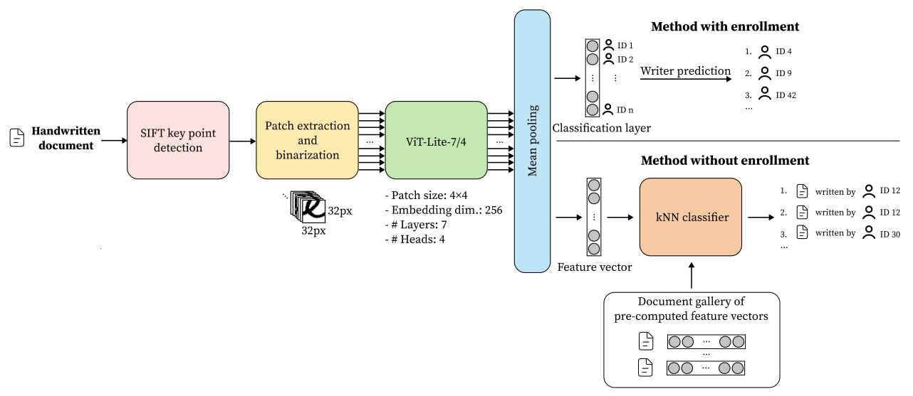

# Writer Identification and Writer Retrieval using Vision Transformer

Code repository of 

> Koepf, M., Kleber, F., Sablatnig, R. (2022). Writer Identification and Writer Retrieval Using Vision Transformer for Forensic Documents. In: Uchida, S., Barney, E., Eglin, V. (eds) Document Analysis Systems. DAS 2022. Lecture Notes in Computer Science, vol 13237. Springer, Cham. [https://doi.org/10.1007/978-3-031-06555-2_24](https://doi.org/10.1007/978-3-031-06555-2_24)

In this paper, we present the first offline writer identification and writer retrieval method based on vision transformer (ViT), and show that a ViT with 3.7M parameter trained from scratch competes with state-of-the-art methods.



*Note: An extended version of the paper might be available on arxiv.org soon.*


## Results on Publicly Available Datasets

### `CVL w/ enrollment`

| Top k | Accuracy |
|-------|----------|
| 1 | 99.0 |
| 2 | 99.3 |
| 3 | 99.6 |
| 5 | 99.9 |
| 10 | 99.9 |

### `CVL w/o enrollment` (using standardized Euclidean distance)

| Measure | Accuracy |
|-------|----------|
| Top 1 | 97.4 |
| *Soft top k* |  |
| 2 | 97.9 |
| 3 | 98.2 |
| 5 | 98.4 |
| 10 | 98.7 |
| *Hard top k* |  |
| 2 | 95.0 |
| *mAP* | 92.8 |

### `ICDAR 2013` (using standardized Euclidean distance)

| Measure | Accuracy |
|-------|----------|
| Top 1 | 96.7     |
| *Soft top k* |          |
| 2 | 98.4     |
| 3 | 98.6     |
| 5 | 98.8     |
| 10 | 99.2     |
| *Hard top k* |          |
| 2 | 76.7     |
| 3 | 54.7     |
| *mAP* | 85.2     |


## Setup

Prerequisites:
- `python 3.8`
- `pip3`

The code in this repository was tested with the following system configurations: `CUDA 11.1`, `Python 3.8`, `PyTorch 1.9.0`

At the time the work was conducted, `PyTorch 2.X` was not available yet and the code has not been tested with `PyTorch 2.X`

In the following, we give instructions how to get up and running with a minimal setup for local installation and `Docker`. We recommend to use the `Docker` image.

### Locally on the Host Machine (using `venv`)

1. Set up a virtual environment: ```python3 -m venv ./venv```
2. Activate the created virtual environment: ```source venv/bin/activate```
3. Depending on the platform, different versions of `PyTorch` are available. Therefore, choose an appropriate `constraints` file (`-c` option) for installing the dependencies:
   - `CUDA 11.1`: 
   ```shell
   pip3 install -r requirements/requirements.txt -c requirements/constraints-cuda111.txt
   ```

   - `CPU`:
   ```shell
   pip3 install -r requirements/requirements.txt -c requirements/constraints-cpu.txt
   ```

   In case the installation of the dependencies fails, try to add the option `--no-cache-dir`. For further information, please consult the official [`PyTorch` documentation]().

### `Docker` Image

We also provide a `Docker` image (`Dockerfile`) based on `python3.8:slim-buster`. Inside the container, you can run training and evaluation as described in section "Training and Evaluating a Model".

#### CPU

- Build the image
   ```bash
   docker build --build-arg HOST_GID=$(id -g) --build-arg HOST_UID=$(id -u) --build-arg CONSTRAINTS_FILE=constraints-cpu.txt -t wi-wr-vit . 
   ```
  
- Run a container in interactive mode (all necessary directories are mounted and container is deleted on shutdown)

   ```bash
   docker run --rm -v $(pwd)/data:/app/data -v $(pwd)/runs:/app/runs -v $(pwd)/saved_models:/app/saved_models -it wi-wr-vit
   ```

#### GPU

- Build the image
   ```bash
   docker build --build-arg HOST_GID=$(id -g) --build-arg HOST_UID=$(id -u) --build-arg CONSTRAINTS_FILE=constraints-cuda111.txt -t wi-wr-vit . 
   ```
  
- Run a container in interactive mode with GPU support (all necessary directories are mounted and container is deleted on shutdown)

   ```bash
   docker run --rm -v $(pwd)/data:/app/data -v $(pwd)/runs:/app/runs -v $(pwd)/saved_models:/app/saved_models --gpus all -it wi-wr-vit
   ```

### IDE/OS Setup
When using an IDE (e.g. `PyCharm`, `IntelliJ`) or desktop environment with indexing functionality, make sure to exclude `data` from indexing *before* preprocessing any files. For `GNOME`, the folder is automatically excluded (a `.trackerignore` file is already placed in `data`). This also applies when you are using a custom directory for the data.


## File Organization

```
├── data             # default folder for datasets
├── dataset_splits   # provided dataset splits. You may add your own dataset splits here
├── Dockerfile       # Docker image (CPU and GPU support)
├── eval.py          # CLI tool for model evaluation
├── README.md        # this file
├── requirements     # Requirement and constraint files for dependency installation
├── requirements     # tracking of training with TensorBoard (default directory)
├── saved_models     # models saved during training (default directory)
├── src              # Custom modules for preprocessing, training and evaluation
└── train.py         # CLI tool for model training
```

For further information, refer to the `README.md` files in the respective sub-directories.


## Training and Evaluating a Model

For training use `train.py` can be used (see`./train.py -h` for further information). 

Example:

```bash
./train.py --model vit-lite-7-4  --optim adamw --lr 0.0005 --num-epochs-warmup 5 --batch-size 128 --num-epochs 60 --num-epochs-patience 10 --num-workers 4 cvl-1-1_with-enrollment_pages
```
   
For evaluating a dataset with a trained model, use `eval.py` (see `./eval.py -h` for further information).

Examples:

- `CVL w/ enrollment` split   
```shell
./eval.py --classification --skip-retrieval --soft-top-k 1 2 3 4 5 6 7 8 9 10 --weights <path to trained model> --num-workers 4 -- cvl-1-1_with-enrollment_pages cvl-1-1_with-enrollment_pages
```

- `CVL w/o enrollment` split using the standardized Euclidean distance as metric
```shell
./eval.py --soft-top-k 1 2 3 4 5 6 7 8 9 10 --hard-top-k 1 2 --weights <path to trained model> --metrics seuclidean --num-workers 4 -- icdar-2013_pages cvl-1-1_without-enrollment_pages
```


## Using Your own Dataset

If you want to use a new dataset, please refer to `dataset_splits/README.md` and `src/README.md`.


## Ideas for Future Improvements

- [ ] Use `PyTorch Lightning` (version 1.7) for training and evaluation
- [ ] Add type hints


## Acknowledgements

The computational results presented have been achieved in part using the [Vienna Scientific Cluster (VSC)](https://vsc.ac.at/home/).


## References

### Paper

```bibtex
@inproceedings{koepf_writer-identification_2022,
   author = {Koepf, Michael and Kleber, Florian and Sablatnig, Robert},
   title = {Writer Identification and Writer Retrieval Using Vision Transformer for Forensic Documents},
   year = {2022},
   isbn = {978-3-031-06554-5},
   publisher = {Springer-Verlag},
   address = {Berlin, Heidelberg},
   url = {https://doi.org/10.1007/978-3-031-06555-2_24},
   doi = {10.1007/978-3-031-06555-2_24},
   abstract = {Writer identification and writer retrieval deal with the analysis of handwritten documents regarding the authorship and are used, for example, in forensic investigations. In this paper, we present a writer identification and writer retrieval method based on Vision Transformers. This is in contrast to the current state of the art, which mainly uses traditional Convolutional-Neural-Network-approaches. The evaluation of our self-attention-based and convolution-free method is done on two public datasets (CVL Database and dataset of the ICDAR 2013 Competition on Writer Identification) as well as a forensic dataset (WRITE dataset). The proposed system achieves a top-1 accuracy up to 99\% (CVL) and 97\% (ICDAR 2013). In addition, the impact of the used script (Latin and Greek) and the used writing style (cursive handwriting and block letters) on the recognition rate are analyzed and presented.},
   booktitle = {Document Analysis Systems: 15th IAPR International Workshop, DAS 2022, La Rochelle, France, May 22–25, 2022, Proceedings},
   pages = {352–366},
   numpages = {15},
   keywords = {Forensics, Vision Transformer, Writer identification, Writer retrieval},
   location = {La Rochelle, France}
}
```

### Datasets

```bibtex
@inproceedings{louloudis_icdar_2013,
	address = {Washington, DC, USA},
	title = {{ICDAR} 2013 {Competition} on {Writer} {Identification}},
	isbn = {978-0-7695-4999-6},
	url = {http://ieeexplore.ieee.org/document/6628843/},
	doi = {10.1109/ICDAR.2013.282},
	urldate = {2021-05-09},
	booktitle = {2013 12th {International} {Conference} on {Document} {Analysis} and {Recognition}},
	publisher = {IEEE},
	author = {Louloudis, G. and Gatos, B. and Stamatopoulos, N. and Papandreou, A.},
	month = aug,
	year = {2013},
	keywords = {dataset},
	pages = {1397--1401},
}
```

```bibtex
@inproceedings{kleber_cvl-database_2013,
	address = {Washington, DC, USA},
	title = {{CVL}-{DataBase}: {An} {Off}-{Line} {Database} for {Writer} {Retrieval}, {Writer} {Identification} and {Word} {Spotting}},
	isbn = {978-0-7695-4999-6},
	shorttitle = {{CVL}-{DataBase}},
	url = {http://ieeexplore.ieee.org/document/6628682/},
	doi = {10.1109/ICDAR.2013.117},
	urldate = {2021-05-08},
	booktitle = {2013 12th {International} {Conference} on {Document} {Analysis} and {Recognition}},
	publisher = {IEEE},
	author = {Kleber, Florian and Fiel, Stefan and Diem, Markus and Sablatnig, Robert},
	month = aug,
	year = {2013},
	keywords = {dataset},
	pages = {560--564}
}
```

```bibtex
@article{he_fragnet_2020,
	title = {{FragNet}: {Writer} {Identification} {Using} {Deep} {Fragment} {Networks}},
	volume = {15},
	issn = {1556-6013, 1556-6021},
	shorttitle = {{FragNet}},
	url = {https://ieeexplore.ieee.org/document/9040654/},
	doi = {10.1109/TIFS.2020.2981236},
	urldate = {2021-08-24},
	journal = {IEEE Transactions on Information Forensics and Security},
	author = {He, Sheng and Schomaker, Lambert},
	year = {2020},
	pages = {3013--3022},
}
```

### Vision Transformer (ViT) model variant used in this work (ViT-Lite-7/4)

```bibtex
@article{hassani_escaping_2021,
   author = {Hassani, Ali and Walton, Steven and Shah, Nikhil and Abuduweili, Abulikemu and Li, Jiachen and Shi, Humphrey},
   title = {Escaping the {Big} {Data} {Paradigm} with {Compact} {Transformers}},
   url = {http://arxiv.org/abs/2104.05704},
   abstract = {With the rise of Transformers as the standard for language processing, and their advancements in computer vision, along with their unprecedented size and amounts of training data, many have come to believe that they are not suitable for small sets of data. This trend leads to great concerns, including but not limited to: limited availability of data in certain scientific domains and the exclusion of those with limited resource from research in the field. In this paper, we dispel the myth that transformers are "data hungry" and therefore can only be applied to large sets of data. We show for the first time that with the right size and tokenization, transformers can perform head-to-head with state-of-the-art CNNs on small datasets. Our model eliminates the requirement for class token and positional embeddings through a novel sequence pooling strategy and the use of convolutions. We show that compared to CNNs, our compact transformers have fewer parameters and MACs, while obtaining similar accuracies. Our method is flexible in terms of model size, and can have as little as 0.28M parameters and achieve reasonable results. It can reach an accuracy of 95.29 \% when training from scratch on CIFAR-10, which is comparable with modern CNN based approaches, and a significant improvement over previous Transformer based models. Our simple and compact design democratizes transformers by making them accessible to those equipped with basic computing resources and/or dealing with important small datasets. Our method works on larger datasets, such as ImageNet (80.28\% accuracy with 29\% parameters of ViT), and NLP tasks as well. Our code and pre-trained models are publicly available at https://github.com/SHI-Labs/Compact-Transformers.},
   urldate = {2021-07-19},
   journal = {arXiv:2104.05704 [cs]},
   month = jun,
   year = {2021},
   note = {arXiv: 2104.05704},
}
```